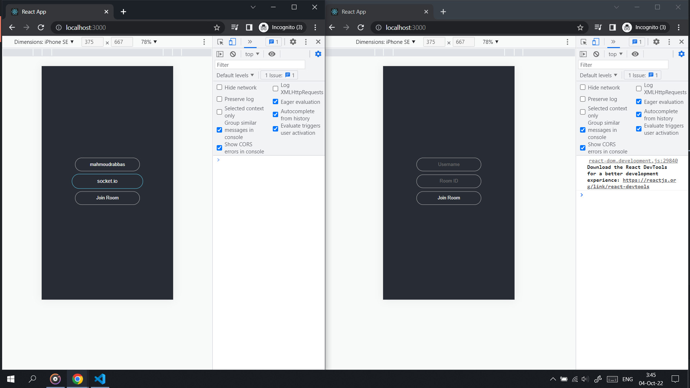

## Available Scripts To Frontend

### `npm install`

In the client directory, you can run:

### `npm start`

## Available Scripts To Backend

### `npm install`

In the server directory, you can run:

### `nodemon index.js`
